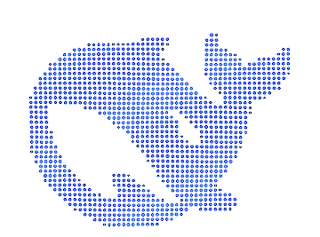

# DeepSeek Harness 点阵背景插件

[English](README.md)

一个可插拔的 [DeepSeek Harness](https://github.com/deepseek-ai/deepseek-harness) Web 插件：把会话区域背景替换为由 Canvas 实时渲染的 DeepSeek 点阵鲸鱼。



## 功能

- **鲸鱼点阵**：从 Harness 内置 DeepSeek FishLogo 路径采样，共 1196 个点，网格为 `54 × 40`。
- **呼吸动效**：整只鲸鱼以 `5.5s` 为周期缓慢缩放，模拟呼吸。
- **点颜色随呼吸律动**：每个点拥有独立空间相位，颜色深浅像波浪一样从鲸鱼身上流过，而不是全图同步闪烁。
- **点与点之间的相对运动**：点阵会形成横穿鲸鱼的波动，并在吸气时从鲸鱼中心向外轻微扩散。
- **自动适配深浅主题**：跟随 Harness 的 `data-ds-dark-theme` 自动切换调色板。
- **支持减少动态效果**：`prefers-reduced-motion: reduce` 时渲染静态帧。
- **无需修改前端文件**：作为标准 `dsh` profile bundle/plugin 安装，不修改 `dist/index.html`。

## 演示

上方 GIF 展示了一个浅色主题下的完整呼吸周期（为减小体积做了降采样）。实际插件以浏览器帧率和原生分辨率运行。

## 环境要求

- [DeepSeek Harness](https://github.com/deepseek-ai/deepseek-harness) `0.1.0-rc.6` Web profile（插件使用该版本的布局 class）
- `PATH` 中有 `dsh`
- `PATH` 中有 `pnpm`（`dsh plugin` 会调用它）

## 安装

克隆仓库并安装到 `web` profile：

```bash
git clone https://github.com/Zh-U-hB/dsh-dot-background.git
cd dsh-dot-background
./install.sh
```

也可以不克隆，直接按路径安装：

```bash
dsh plugin --profile web add /absolute/path/to/dsh-dot-background
```

由于包声明了 `dsh.bundle.patch`，`dsh plugin add` 会自动把插件追加到 profile bundle 列表并插入插件行：

```yaml
- id: dot-background
  name: '@deepseek-ai/dsh-dot-background'
```

然后重启 Web 界面：

```bash
dsh web
```

打开页面后强制刷新一次（`Ctrl+Shift+R` / `Cmd+Shift+R`）。如果插件源码已经在运行，内置 client HMR 通常会自动加载新的 client bundle。

## 卸载

```bash
./uninstall.sh
# 或
dsh plugin --profile web remove @deepseek-ai/dsh-dot-background
```

然后重启 `dsh web`。

## 配置

动画参数位于 [`lib/client.template.js`](lib/client.template.js) 顶部：

| 常量 | 默认值 | 含义 |
| --- | --- | --- |
| `BREATH_MS` | `5500` | 一次呼吸循环的时长 |
| `SCALE_MAX` | `1.045` | 吸气时的最大整体缩放 |
| `ALPHA_MIN` | `0.88` | 呼气时的最低整体透明度 |
| `LOGO_WIDTH_RATIO` | `0.82` | 鲸鱼宽度与会话列宽度的比例 |
| `LOGO_VERTICAL_ALIGN` | `0.76` | 鲸鱼的垂直位置 |

点阵数据（位置、基础半径、基础透明度）由 DeepSeek FishLogo 路径采样生成。修改采样参数后，重新生成 client bundle：

```bash
python3 scripts/generate_client.py
```

生成器会在当前 `dsh` npx 缓存中自动查找 `@deepseek-ai/dsh-client-ui-primitives`，也可以显式指定路径：

```bash
DSH_PRIMITIVES=/path/to/dsh-client-ui-primitives/lib/index.js \
  python3 scripts/generate_client.py
```

生成器依赖 `cairosvg` 和 `pillow`：

```bash
python3 -m pip install cairosvg pillow
```

## 工作原理

```text
dsh profile boot
        │
        ├─ dsh-dot-background bundle patch 插入插件行
        │
        ├─ lib/index.js      宿主侧（空挂载点）
        │
        └─ lib/client.js     浏览器侧
              ├─ 注入布局 CSS
              ├─ 找到 .pI_x6G_centerCol
              ├─ 在会话内容后方创建 z-index:-1 的 canvas
              └─ 渲染循环：
                   整体呼吸  → 缩放 + 透明度
                   单点相位  → 颜色深浅 + 透明度 + 半径
                   单点漂移  → 波动 + 径向偏移
```

Canvas 是会话中心列的负 z-index 子元素，因此鲸鱼位于消息、输入卡片和所有交互 UI 之后，且不会拦截鼠标事件。

## 目录结构

```text
.
├── lib/
│   ├── index.js             # 宿主侧插件入口
│   ├── client.template.js   # 浏览器侧源码模板
│   └── client.js            # 生成的浏览器 bundle（已提交）
├── scripts/
│   └── generate_client.py   # 采样 FishLogo 并重新生成 client.js
├── docs/
│   └── demo.gif             # 渲染预览
├── cordis.patch.yml         # profile bundle patch
├── package.json             # dsh.client + dsh.bundle 元数据
├── install.sh               # dsh plugin add 辅助脚本
├── uninstall.sh             # dsh plugin remove 辅助脚本
└── LICENSE
```

## 兼容性

- 目标版本为 DeepSeek Harness `0.1.0-rc.6`。
- CSS 选择器跟随该版本会话/布局模块的哈希类名。如果未来 Harness 重命名这些类，请更新 `lib/client.template.js` 中的选择器并重新生成。

## 许可证

[MIT](LICENSE)

鲸鱼路径源自 `@deepseek-ai/dsh-client-ui-primitives`（MIT，Copyright (c) 2026 DeepSeek）。本项目不是 DeepSeek 官方产品。
